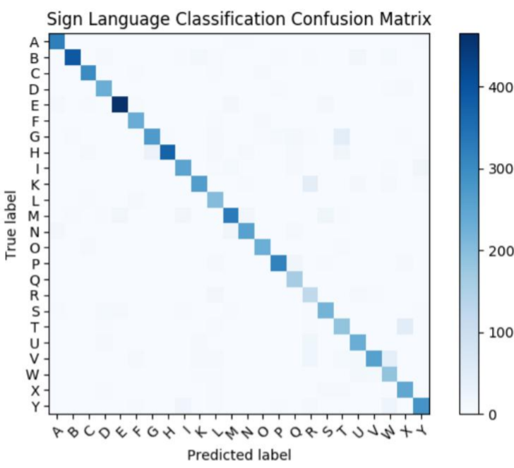

# Ladder-Networks-for-Sign-Languages
## Ladder Networks
Ladder networks are an amalgamation of 
supervised and unsupervised learning in deep neural networks. In ladder networks, both the supervised and the unsupervised components are trained simultaneously to minimize the sum of the supervised and unsupervised cost functions by backpropagation, avoiding the need of layer-wise pre-training. Ladder networks achieve state of the art performance in semi-supervised MNIST and CIFAR-10 classifications.

---
## Outline

1. [Introduction](#introduction)
2. [Dataset](#dataset)
3. [Methodology](#methodology)
   * [Ladder Network Overview](#ladder-network-overview)
   * [Cost Function](#cost-function)
4. [Experiments](#experiments)
   * [Experiment Setup](#experiment-setup)
   * [Model Architecture](#model-architecture)
   * [Hyper Parameter Tuning](#hyper-parameter-tuning)
5. [Results](#results)
6. [Error Analysis](#error-analysis)
7. [References](#references)

---

## Project Description
### Introduction
The project aims to demonstrate the ability of ladder networks to translate sign languages into text while using lesser data than the traditional models. Vast amount of labelled data in context sign languages is a rare occurence. Ladder networks are known to reduce the amount of labels required and thus can make the translation task feasible.

### Dataset
Sign Language MNIST dataset from kaggle is used for this project. The dataset contains all the alphabets except J and Z because they are motion based and cannot be captured due to obvious reasons. In total there are 23 classes. The dataset contains 27455 training images 3586 validation images and 3586 test images. Each image is uni-channel i.e. grayscale image with dimensions as 28x28. The preprocessing stages include normalizing each pixel value from 0 to 1 to prevent any sort of overflows. No image augmentation was done whatsoever as the required amount of data was already sufficient. The dataset had a fair class balance wherein each class had an average of 1143 images. The maximum number of images for a class were 1294 and the least was 957.  
[Link to dataset](https://www.kaggle.com/datamunge/sign-language-mnist)

### Methodology
#### Ladder Network Overview  

Two Layer Ladder Network   |  
:-------------------------:|
 |  

Ladder network is a semi-supervised learning network which combines a traditional Deep Neural Network and an autoencoder (used to reconstruct activation at each layer). The working of ladder network is explained as follows:
1. input x is fed and output y is returned.
2. x is fed into the regular deep neural network. The values and the layers of this network are called "clean".
3. x is fed into an auto-encoder. The auto-encoder has the same layers and the weights as that of the deep neural network. However Gaussian noise is added to each layer's input. The noise serves the purpose of regularization effect.
4. The autoencoder then propogates backward and attempts to recreate each layers pre-activation (i.e. the dot products of weights of that layer and the input to that layer) with the help of a denoising function, the corrupted pre-activation value, and the previous layer's pre-activation.

#### Cost Function
Ladder Network Algorithm and Cost Function |  
:-------------------------:|
 |  

The loss function for the ladder network is a combination of both cross entropy loss (derived from the classification part) and the sum of all the layers' reconstruction cost. In context of CNN ladder network only the reconstruction loss of last layer is taken into consideration. The effect of the reconstruction cost is such that it forces the network to learn weights and distributions such that it can generate accurate predictions and generalize unseen data.

For the project CNN are used within the ladder network. Convolutional ladder networks are similar to regular ladder networks except their reconstruction cost is only compromised in the last layer's reconstruction cost.

### Experiments
#### Experiment Setup
For the experiment a baseline CNN and a ladder network was employed with varying number of 
labelled examples. Primary metric for comparison was accuracy as the dataset has a fair class balance therefore accuracy can provide a genuine insight.

#### Model Architecture
Convolutional ladder network with the following architecture : 32 3X3 filters &#8594; 64 3x3 filter &#8594; 128 3x3 filters &#8594; 128 fully connected layer &#8594; softmax layer.  
The process of finding the optimal architecture:
 1. Started without CNN and only a fully connected network but resulted in overfitting.
 2. Faced with an underfitting problem when convolutional layers where initially used. Initially 16, 32, 64 3x3 filters were used. After that more filters were added and two fully connected layers were added in the end of sizes 500 and 250 respectively.
 3. Adding two dense layers caused overfitting and thus final layer was just one dense layer with 128 nodes.
 
 #### Hyper Parameter Tuning
 For hyper parameter tuning a coarse to fine process was followed. 
 1. Batch Size &#8594; 32
 2. Learning Rate &#8594; 0.001
 3. Denoising cost for last layer &#8594; 3
 4. Noise stdev &#8594; 0.05
 
 ### Results
 These results were observed using the test dataset.  
 
 | Model Architecture | Num Labelled Per Class | Accuracy | Precision | Recall |
 |--------------------|------------------------|----------|-----------|--------|
 | Baseline CNN       |           10           | 0.5297   | 0.5313    | 0.5114 |
 | Ladder Network     |           10           | 0.6606   | 0.6382    | 0.6481 |
 | Baseline CNN       |           40           | 0.7379   | 0.7573    | 0.7496 |
 | Ladder Network     |           40           | 0.8447   | 0.7874    | 0.8021 |
 | Baseline CNN       |           70           | 0.7799   | 0.7666    | 0.7679 |
 | Ladder CNN         |           70           | 0.8898   | 0.8256    | 0.8436 |
 | Baseline CNN       |           100          | 0.8118   | 0.8030    | 0.8000 |
 | Ladder CNN         |           100          | 0.9274   | 0.8801    | 0.8940 |
 | Baseline CNN       |           200          | 0.8302   | 0.8190    | 0.8134 |
 | Ladder Network     |           200          | 0.9533   | 0.9041    | 0.9166 |
 
 The ladder network out-performs the baseline CNN in all the settings in all the evaluation metrics viz. accuracy, precision, recall. The ladder CNN with 100 labels per class performs equivalent to baseline CNN with 200 labels per class. Thus we can see that ladder networks show promising results even when the labelled data is less.
 
 Two confusion matrices were prepared one at 10 labels per class and other at 200 labels per class.
 
 Confusion Matrix(labels = 10) |  Confusion Matrix(labels = 200)
:-------------------------:|:-------------------------:
  |  
 
 
 
### References
1. [Rasmus, Antti, et al. “Semi-Supervised Learning with Ladder Networks.” Advances in Neural Information Processing Systems. 2015.](https://arxiv.org/abs/1507.02672)
2. [Rasmus, Antti, Tapani Raiko, and Harri Valpola. “Denoising autoencoder with modulated lateral connections learns invariant representations of natural images.” arXiv preprint arXiv:1412.7210 (2014).](https://arxiv.org/abs/1412.7210)
3. [Rasmus, Antti, Harri Valpola, and Tapani Raiko. “Lateral Connections in Denoising Autoencoders Support Supervised Learning.” arXiv preprint arXiv:1504.08215 (2015).](https://arxiv.org/abs/1504.08215)
4. [Valpola, Harri. “From neural PCA to deep unsupervised learning.” arXiv preprint arXiv:1411.7783 (2014).](https://arxiv.org/abs/1411.7783)  
**Note:** Not an exhaustive list
